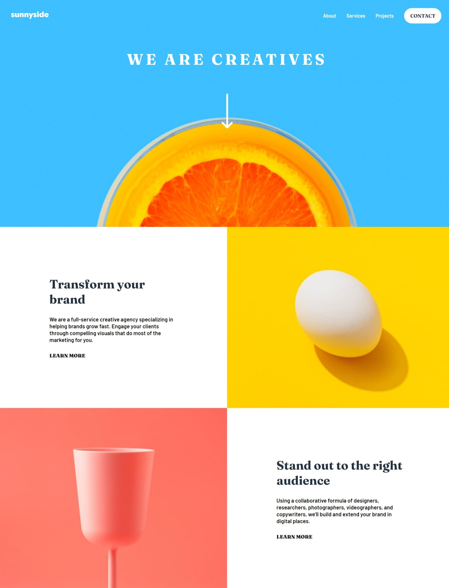

# Sunnyside agency landing page 

This is a solution to the [Sunnyside agency landing page challenge on Frontend Mentor](https://www.frontendmentor.io/challenges/sunnyside-agency-landing-page-7yVs3B6ef). 

## Table of contents

- [Overview](#overview)
  - [The challenge](#the-challenge)
  - [Screenshot](#screenshot)
  - [Links](#links)
- [My process](#my-process)
  - [Built with](#built-with)
- [Author](#author)

## Overview

### The challenge

Users should be able to:

- View the optimal layout for the site depending on their device's screen size
- See hover states for all interactive elements on the page

### Screenshot

### Links

- Live Site URL: [Sunnyside Live!](https://angarcaz.github.io/sunnyside/)

## My process

### Built with

- Semantic HTML5 markup
- SCSS custom properties
- Flexbox
- CSS Grid
- Javascript

## Author

- [@angarcaz](https://github.com/angarcaz/)
- [Frontend Mentor](https://www.frontendmentor.io/)